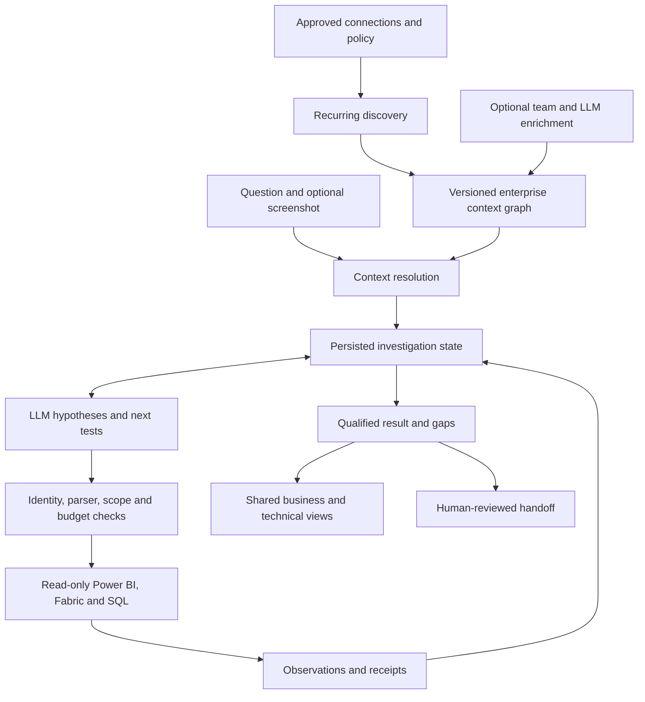

# Self-discovering enterprise investigator architecture

The [September 18 mission](../../SELF_DISCOVERING_ENTERPRISE_INVESTIGATOR_PLAN.md)
supersedes manual model onboarding as the primary path and the old A-J proof-first
order. **Discover first. Reason dynamically. Query real systems. Follow evidence.
Admit uncertainty.** Preserve the platform and bounded-v1; evolve catalog-v2.

Read the [architectural review](enterprise-discovery-pivot.md) first: repository
audit, exact manual dependencies, KEEP/SIMPLIFY/REFACTOR decisions, migration and
unknown-domain experiment. Architecture is not shipped functionality;
[current status](../current-delivery-status.md) owns completion claims.

| Document | Purpose |
| --- | --- |
| [Assessment and migration](current-assessment-and-migration.md) | Code audit and baseline reconciliation |
| [Enterprise connection and context](onboarding-and-model-context.md) | Discovery, graph, coverage and enrichment |
| [Contracts and tools](contracts-and-tools.md) | Context/query/evidence boundaries |
| [Planner and safety](planner-and-safety.md) | Reasoning, governed dispatch and outcomes |
| [Stages and acceptance](phases-and-acceptance.md) | Nine checkpoints in cohesive milestones |
| [Architectural review](enterprise-discovery-pivot.md) | Complete A-J proposal and frozen experiment |

Discovery grants no additional data permissions. Missing business meaning limits
conclusions, not basic technical investigation. Manual onboarding remains fallback,
override and fixture mode. The [pre-pivot architecture](archive/2026-09-16-README.md)
is retained as history.
