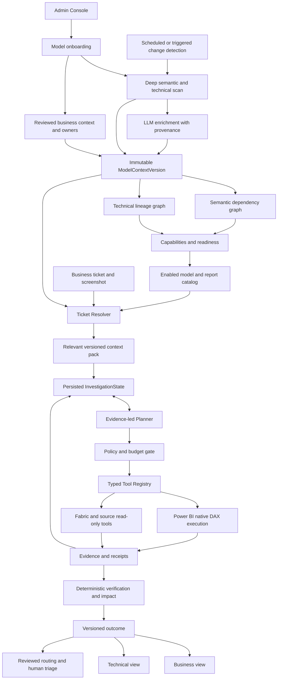

# Metadata-driven investigator: product and engineering plan

**Status: Phase A verified; B-E implementation slices and F/G governed adaptive diagnostic foundations implemented. [Reviewed watermark conditions](../watermark-freshness-milestone.md) extend the proof slice; B-G full exit gates remain open.** Updated 2026-09-14.

The [first-class product plan](../../METADATA_DRIVEN_INVESTIGATOR_FIRST_CLASS_PRODUCT_PLAN.md) controls this revision. It supersedes the previous A–I roadmap and the proposal to treat a local expression compiler as the semantic execution gate. [Existing implementation facts](current-assessment-and-migration.md) remain distinct from proposed functionality.

## Product direction

**A team onboards its model once. A user reports a symptom. The investigator chooses safe tests from evidence.**

The admin/data team registers connections and models, scans metadata, reviews business context and readiness, and enables models for tickets. Change detection maintains versioned context. Business users select an enabled report and describe the problem; they do not select source tables or technical layers.

Power BI is the authoritative DAX execution engine. The investigator evaluates deployed measures, recursively evaluates dependencies, reproduces supported visual context and requests bounded dimensional breakdowns. Semantic IR describes operations, dependencies and comparison contracts; it does not recreate arbitrary DAX. Upstream equivalent calculations require independent support and validation.

Preserve the platform and `bounded-v1`. Introduce `catalog-v2` incrementally with approved scope, read-only tools, persisted evidence, deterministic verification and reviewed routing. **Predefine capabilities, not investigation paths.**

## Planning package

| Document | Purpose |
| --- | --- |
| [Onboarding and model context](onboarding-and-model-context.md) | Admin lifecycle, entities/APIs, enrichment, business authority, readiness, change detection |
| [Current assessment and migration](current-assessment-and-migration.md) | Existing code and reuse/refactor decisions |
| [Contracts and tools](contracts-and-tools.md) | Versioned contracts, native semantic execution, initial tool families |
| [Planner, persistence and safety](planner-and-safety.md) | Dynamic decomposition, state, budgets, verification and classification |
| [Phases and acceptance](phases-and-acceptance.md) | A–J tasks, dependencies, exit gates and eight product acceptance tests |
| [Progress tracker](../progress.md) | Current status and historical evidence |
| [Implementation handoff](../../PROJECT_STATE_AND_NEXT_STEPS.md) | What exists and its limitations |

## Target architecture

## Phased delivery

| Phase | Deliverable | Status |
| --- | --- | --- |
| A | Freeze and reconcile `bounded-v1` | Verified; baseline tag and evidence recorded |
| B | Product model onboarding foundation | In progress; [implemented slice](../model-onboarding.md) |
| C | Deep semantic catalog and change detection | In progress; [scan queue and dependency analysis](../catalog-scans-and-semantics.md) |
| D | Native semantic execution and typed tools | In progress; [native catalog diagnostics](../native-catalog-diagnostics.md) |
| E | Semantic operation and capability evaluator | In progress; [capability/evidence decisions](../capability-evidence-assessment.md) |
| F | Persisted investigation state and runtime registry | In progress: durable sessions plus [shared usage/cancellation](../runtime-governance-milestone.md) |
| G | Evidence-led planner and deterministic verification | In progress: [adaptive diagnostic loop](../adaptive-investigation-milestone.md); causal verifiers pending |
| H | Frozen-engine complex/unseen metric acceptance | Planned |
| I | Unified ticket product experience | Planned |
| J | Reviewed routing and human triage | Planned |

B includes a basic admin UI/API; it is not postponed until I. D has minimal admission checks from its first execution; E adds full semantic eligibility. F supplies durable orchestration before G enables the planner. Every phase includes tests.

The architectural milestone is **A–H**: real Power BI evaluation of unseen measures, decomposition, adaptive tests and verified healthy/defect/evidence-gap outcomes. H includes all eight required acceptance families. I–J complete the ticket workflow and reviewed handoff. No phase is complete merely because its PR merged.

## Minimum coherent refactor

Add versioned onboarding/context; resolve measures from that catalog; expose native measure/dependency/dimensional reads and supported upstream tools; evaluate capabilities independently of names; persist the hypothesis/evidence loop; and apply deterministic verification. Freeze that engine, then discover and investigate new supported measures without runtime Python changes.

A complex expression can be queryable in Power BI even if upstream reconciliation is unavailable. Queryability, decomposition, visual-context replay, provenance and cause verification are separate readiness facts. The product must communicate these limits without refusing every unfamiliar metric.

## Decisions now

- The new product plan governs direction; preserve the working foundation and scope boundary.
- Onboarding, complex decomposition, dimensional diagnostics and change detection are core v2 work.
- Native Power BI supplies semantic values; IR supports analysis and bounded upstream comparison only.
- Separate discovered, derived, LLM-inferred and team-confirmed context with approval/version provenance.
- Use local SQLite initially with organization/environment scoping and additive schemas; hosted multi-tenant security is not thereby delivered.
- Use capability states and evidence gates, not confidence percentages.
- One run powers both views. Human review controls delivery; no runtime fixes, PRs or releases.

## Decisions that can wait

Hosted multi-tenant deployment, graph/vector databases, multi-agent architecture, additional platforms and full OCR can wait. Calculation groups, arbitrary DAX analysis, many-to-many reconciliation and all time-intelligence patterns can remain explicitly partial/unsupported. **Complex measures composed from supported operations do not wait.**
