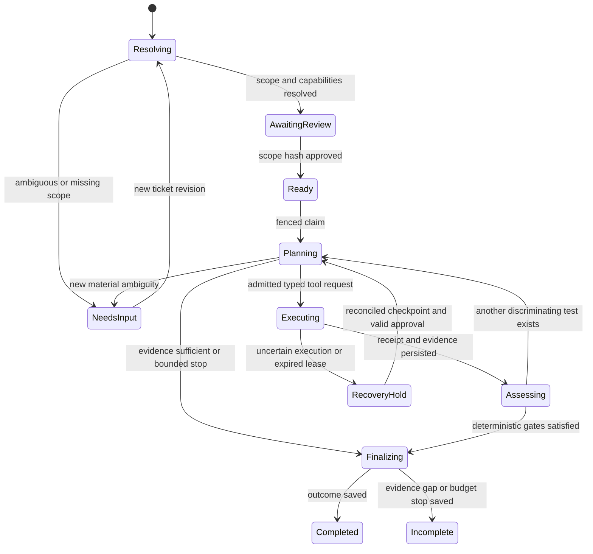

# Planner, persisted execution and safety

Revised for the [first-class product plan](../../METADATA_DRIVEN_INVESTIGATOR_FIRST_CLASS_PRODUCT_PLAN.md). The planner consumes an enabled model's immutable context pack; Power BI supplies semantic values.

## Workflow and action contract

Execution status does not encode business classification. A completed investigation can classify expected behavior or a defect; an incomplete one can retain useful verified observations while classifying unresolved. Provider failure, cancellation and exhausted budgets have explicit stop reasons, not invented business findings.

The planner returns a validated action union:

- `request_clarification`: missing field/reason and concise user-facing question.
- `propose_hypothesis`: short falsifiable claim, supported asset IDs and expected discriminating observation.
- `request_tool`: registry name, typed arguments, hypothesis ID and purpose code.
- `revise_hypothesis`: evidence IDs, supported/rejected/untestable status and concise reason.
- `propose_outcome`: candidate classification and referenced findings.

The deterministic orchestrator validates scope, enabled model/context version, capability, permission, evidence existence, budget and state revision before accepting an action. It alone commits state and final outcomes. It rejects invented references and repeated equivalent requests. No private chain-of-thought is requested, persisted or displayed; retain only concise testable claims, selected tests and evidence-linked reasons.

## One iteration

1. Load the approved scope, ModelContextVersion, confirmed business context, pinned metadata/lineage, capability decisions and current state under its lease.
2. Supply the planner only relevant definitions, sanitized observations, open hypotheses, remaining budgets and eligible tools. Metadata comments and screenshot text are data, never instructions.
3. Validate the returned action schema and references. At most one repair attempt is allowed for malformed planner output, charged to the same budget; repeated invalid output produces an incomplete outcome.
4. For a tool: reserve its maximum admitted resources and atomically persist the request before dispatch.
5. Execute through the registry. Recheck runtime identity and the definition/provenance required by the tool. Do not run outside approved scope because the LLM proposed it.
6. Persist receipt, immutable evidence and observations; settle actual costs; update the state revision and event log in one transaction.
7. Present new evidence to the planner. A refuted hypothesis must remain visible as refuted, not be silently deleted. Record a proposed next test only if it can resolve a remaining uncertainty.
8. Apply deterministic stop/verification gates. Persist outcome or continue.

Hypothesis families such as scope mismatch, freshness, missing records and transformation difference are acceptable generic vocabulary. Their selection and tests must depend on discovered operators, lineage and observed results. They must not dispatch by report name, metric name, injected fixture label or a fixed five-layer sequence.

## Controlled decomposition and dimensional diagnostics

Load relevant context, not the entire estate: target report/visual, metric dependency closure, candidate dimensions/relationships, upstream edges, confirmed business definition and current capabilities. ContextPack retains all source versions and uncertainty. LLM enrichment can suggest search terms/tests but cannot override confirmed policy or missing evidence.

For a derived/ratio metric, evaluate the parent in Power BI, inspect dependencies and evaluate relevant children under their effective contexts. Recurse into the child whose evidence merits another test; do not query every layer for every dependency. Proposed initial recursion depth is 4 and at most 12 distinct dependency nodes, within the shared tool/query budget. Cycles and unsupported context modifiers produce explicit gaps.

When warranted, choose a dimension from model metadata/relationships. Compare scoped native breakdowns, retain omitted buckets and request finer slices only within an approved diagnostic scope. A non-additive metric's dimensional values do not sum to its overall value. Use component evidence and complete coverage before claiming a dimension explains the whole discrepancy.

A context counterfactual is a separate derived-scope observation. It cannot silently replace the user's filters or relax RLS/identity. Broadening beyond the approved diagnostic envelope requires scope review. Source replay remains bounded relational evaluation; semantic counterfactuals execute in Power BI. Neither modifies the deployed model or data.

Potential next tests include freshness, report-context reproduction, dependency evaluation, dimensional slicing, transform inspection or application intent. No requirement fixes their order. For application hypotheses require an independent intent source with provenance and business key/version mapping; audit committed state alone is insufficient.

On material context change, disablement or expired required permission, stop new dispatch and persist the reason. Pin old results to their original context; re-resolution/review creates a new scope/context revision rather than rewriting history.

## Persistence and restart contract

Add v2 tables for `investigations`, `state_events`, `scope_revisions`, `capability_decisions`, `tool_requests`, `tool_receipts`, `observations`, `evidence`, `hypotheses`, `budget_entries`, and `outcomes`. Include schema/engine version and uniqueness constraints for request/idempotency keys. Evidence references old stores by immutable ID/hash; do not imply atomic commits across separate SQLite databases.

In the engine database, commit tool receipt, evidence references, budget settlement, event and state revision together. Stage large artifacts to a temporary file, verify hash, atomically rename, then commit the reference; reconcile orphan files after crashes. Never commit an evidence reference to an unfinished artifact.

Use compare-and-swap revision and a lease fencing token. A stale worker cannot finish a run or publish an outcome after another worker owns the lease. Renew before expiration while bounded work is active. Cancellation prevents new requests and attempts adapter cancellation; if a remote query may still be running, retain uncertainty and its budget reservation until reconciled.

The existing reviewed worker deliberately does not reclaim expired RUNNING tickets. V2 recovery is explicit: inspect the outstanding request and receipt. Reuse a verified committed receipt; never rerun it silently. If execution may have happened but no result was captured, enter `RecoveryHold`. A replacement read requires a recorded retry decision within the original approval/budget, a new attempt ID and new capture/version checks. Read-only does not mean the repeated observation describes the same snapshot. Do not claim exactly-once execution across remote systems.

Clarification that changes scope creates a new scope revision and approval requirement. Retain old evidence for audit, but it is ineligible for the new scope unless a deterministic compatibility check explicitly permits reuse. Definition or identity changes also invalidate affected capabilities and approvals.

## Initial configurable budgets

These are proposed development defaults, not existing settings or a guarantee of free usage:

| Limit | Proposed default and handling |
| --- | --- |
| Run wall time | 900 seconds; reserve the tool's maximum admitted duration before starting |
| Planner calls | 6 total including schema-repair attempts; 20,000 cumulative input tokens and 9,000 output tokens; per-call output cap 1,500 initially |
| Tool requests | 12 total; repeated identical request/evidence/context hash is rejected without another read |
| Remote reads | 8 actual query attempts, one at a time; a compound tool must reserve each child call |
| SQL connection recovery | Preserve existing 40613-specific bounded retry policy; connection attempts consume time and are recorded; do not retry arbitrary authentication or query errors |
| Query duration | Connector profile with hard ceiling within remaining run deadline; legacy SQL path currently allows a longer acquisition window, so wrap it with honest reservation rather than advertise a shorter guaranteed timeout |
| Result exposure | At most 1,000 displayed/sample rows and 2 MiB per returned payload; complete-set artifacts require a separately admitted bounded extraction |
| Local replay | At most 100,000 input rows for first slice, explicit memory/time cap, read-only inputs; exceedance returns unsupported/budget gap |
| Estate consumption | Configured daily request/token/spend envelope shared across runs; reject missing live-cost configuration rather than silently remove the cap |

Output limits do not limit database scan cost. Require approved source scope, expected scan profile, pushdown and connector timeout; broad/full scans need a capability with an explicit allowance. The 100,000-order source does not imply every investigation should scan all its related rows. Persist unsuccessful attempts and usage uncertainty too. Keep Azure SQL free-overage configuration unchanged; do not change service tier or resume policy to make a test pass.

## Classification and causal gates

Canonical v2 classes follow section 25 of the new product plan:

`EXPECTED_BEHAVIOR`, `TECHNICAL_DEFECT`, `REFRESH_FRESHNESS`, `SOURCE_OR_APPLICATION_DEFECT`, `BUSINESS_REVIEW_REQUIRED`, `INSUFFICIENT_EVIDENCE`, `UNSUPPORTED_CAPABILITY`, `UNRESOLVED`.

Keep workflow status, classification and delivery status separate. Preserve historical SOURCE_OR_DATA_ISSUE/SOURCE_DATA_ISSUE values with their schema version; do **not** automatically relabel them SOURCE_OR_APPLICATION_DEFECT, which implies stronger evidence. A display adapter can show the original value and explanatory category without fabricating new proof. New outcomes use the new enum and gates below.

- **Expected behavior:** comparable results agree with a referenced authoritative business definition for the confirmed scope. Equal totals alone cannot establish expected business behavior.
- **Technical defect:** a discrepancy plus complete scoped comparison, a supported boundary, provenance and a reproducible causal mechanism. Require actual-output replay and reconciliation to the authoritative baseline. A suspicious definition or first observed difference alone is insufficient.
- **Refresh/freshness:** captured timing and an explicit refresh expectation support the finding. Missing SLA is unknown; freshness does not establish transformation correctness.
- **Source or application defect:** independent authorized intent or an authoritative source contract is violated, with entity/version/action correlation and contradictory/superseding actions checked. Downstream agreement does not exonerate a source write. A committed audit event is not independent intent; missing events alone prove neither a failed write nor a defect.
- **Business review required:** technically consistent observations conflict with an unclear or disputed business expectation. State the ambiguity, not a guessed rule.
- **Unsupported capability:** an explicitly unsupported required operation prevents the requested conclusion; retain any safe diagnostic results.
- **Insufficient evidence:** required scope/provenance/authority/completeness is missing; name what would resolve it. Clarifiable missing user scope produces NEEDS_INPUT workflow status before more execution.
- **Unresolved:** competing explanations or a bounded stop remain after available tests; temporary outage is recorded as an availability reason, not semantic unsupportedness. Preserve observations without promoting them to causes.

“First verified boundary” requires eligible comparable evidence for the relevant upstream prefix; a missing earlier boundary allows only “first observed difference among checked assets.” Finding one cause does not justify claiming there are no others.

Impact derives from evidence: amounts grouped by currency, affected keys with complete-set proof, and ratio numerator/denominator effects. Owner routing comes from an authoritative ownership mapping with provenance; missing owner creates a review hold. Do not infer an owner from a display name.

## Risk controls and required negative tests

| Risk | Control and test |
| --- | --- |
| Arbitrary SQL/DAX | Tool API accepts IR/references only; renderer allowlists operators and catalog identifiers, parameterizes values, rejects statements/functions outside grammar. Test malicious identifiers, comments, compound statements and unsupported expressions. |
| Prompt injection in definitions/screenshots | Treat all collected content as untrusted data; no tool authority from text. Test instructions embedded in measure descriptions, report titles and attachment text. |
| Tool misuse and cross-tenant reads | Recheck asset/tenant/workspace/identity against approved estate and scope; no model-supplied endpoints or tokens. Test forged IDs and changed identity. |
| Query cost and infinite loops | Reservations, wall time, one active read, step/token budgets, request deduplication and no-progress stop after two non-informative iterations. Test failed calls charging budget. |
| Data exposure | Least-privilege credentials outside repo/state; redacted samples, artifact access checks and no secrets in errors/URLs. Test unauthorized artifact and unrelated-run access. |
| Untrusted metadata | Hash plus source/scan/authority validation; unsupported parser nodes and stale versions block proof. Test valid hashes on semantically wrong or unauthorized metadata. |
| Screenshot overclaim | Attachment is context; extracted metric/filter values require catalog resolution and user confirmation. Never treat pixels as a current database observation. |
| False root cause | Deterministic verification matrix, complete evidence and scope gates. Test equal aggregates hiding offsetting errors, stale receipts and missing earlier boundaries. |
| Bug spam | No planner delivery tool. Reviewed immutable envelope, idempotency, destination policy, verified eligibility and separate delivery receipt. Test duplicate approval/retry and stale outcome rejection. |
| Replay escape | Isolated relational IR only; no filesystem/network functions, extensions or arbitrary notebook execution. Test unauthorized functions and resource exhaustion. |

Issue/email delivery remains a separate reviewed action. Preserve the existing envelope's issue-then-email dependency where email references the issue. Investigation code never edits source data, writes fixes, creates code PRs or triggers releases.
