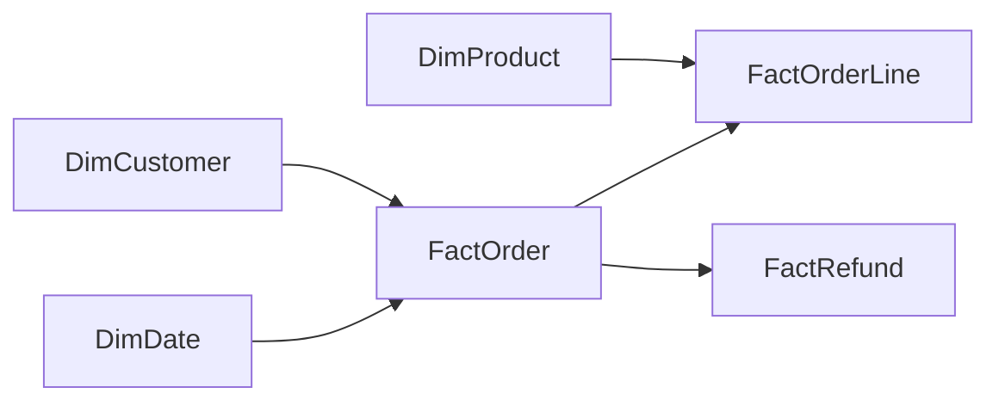

# Power BI reporting

Tracking: [PBI-001/002, issue #15](https://github.com/bcsnpc/data-investigation-agent/issues/15).

## Deployed artifacts

All artifacts are in `ws-investigator-dev`, using the enterprise Fabric account.

- Semantic model: `sm_orderops`, `a77a8464-06d8-42dc-9ec8-832e813346f4`.
- [Executive Sales](https://app.powerbi.com/groups/09cea7db-63ec-41f0-9cf0-872a6dc5c61d/reports/0a81b8dc-7d16-46c6-ad2f-5a0bf97b92bd): net sales, net cash, orders, average order value, monthly trend, product groups, states and capture/refund reconciliation.
- [Order Operations](https://app.powerbi.com/groups/09cea7db-63ec-41f0-9cf0-872a6dc5c61d/reports/44e960a6-d470-49e4-a791-cc9e8c5c6783): order/status filters, cancellations, order totals, and Order Detail drillthrough with individual lines and refund events.
- [Product Performance](https://app.powerbi.com/groups/09cea7db-63ec-41f0-9cf0-872a6dc5c61d/reports/5d5495a7-0385-4608-8958-c7dd12dd9a10): product group/product filters, net sales, sold/refunded units and discount/refund ratios.

The baseline has one broad category, Office Electronics. Charts use its more
informative subcategories, labelled Product Group; category remains in the model
and product detail table. The reports are private workspace artifacts, not public
Publish-to-web reports.

## Model and filtering contract

The six tables use Direct Lake partitions through the Gold SQL analytics endpoint.
The native TMSL and PBIR files are committed under `infra/powerbi` and are generated
by `build_powerbi_model.py` and `build_powerbi_reports.py`.

Relationships filter from the unique side to the many side. There are no
bidirectional relationships or ambiguous paths. `DimDate` is a contiguous
365-day table; customer and product dimensions contain 20,000 and 150 unique keys.
They are derived only from a READY Gold run by
`nb_ordersops_reporting_dimensions`, with count/key/persisted-row checks.

Financial and unit measures sum Gold order-line measures so product filters work
without multiplying order headers. Order Count uses distinct line order IDs,
including cancelled orders. Funded Orders includes paid cancellations. Average
Order Value divides funded sales after discounts, before refunds, by funded orders.
Discount % and Refund % divide totals, not averages of row percentages.

Money measures return blank if the filter context contains multiple currencies.
The verified baseline is USD only; no exchange rates or currency conversion exist.
Unpaid cancellations contribute zero money. Paid cancellations preserve captures
and refunds with zero net amounts. Refunded units include cancellations before
shipment and do not imply a physical warehouse return.

Sales measures use the original order-date cohort. Event Refund Amount and Refund
Events use refund headers, filtered by order/customer and optional refund_day.
Product filters intentionally do not propagate to refund headers; product-level
refund analysis must use the line-based Refund Amount measure. Do not add header
refund totals to line refund totals. Empty contexts can display Power BI's Blank;
that is distinct from a recorded zero. Raw fact numeric columns are hidden and
implicit measures are discouraged.

## Drillthrough

In Order Operations, select an order using the Order ID filter, or right-click an
order ID in the order table and choose **Drill through → Order Detail**. The page
receives the order ID and existing filter context. It shows exact line and refund
amounts in tables; summary cards may abbreviate large numbers. Return using the
Order Operations page tab. The Order Detail page also has its own Order ID filter.

Verified example: `ORD-000002`, customer `CUST-018515`, contains two lines and one
refund event. Capture 1,682.64 − refund 153.00 = net cash 1,529.64. Its mouse line
has zero net cash after refund; its dock line retains 1,529.64. This completes the
manual source-order trace from app/SQL through Bronze, Silver, Gold and Power BI.

## Deployment and refresh

Run serially while source layers are stable; recurring orchestration is not yet
implemented. Use the existing enterprise CLI sign-in, not personal SQL credentials.

1. Complete Gold and require `Files/validation/latest.json` to be READY.
2. Deploy/run `scripts/deploy_reporting_dimensions.py`; wait for
   `Files/reporting/latest.json` to be READY with the same Gold run ID.
3. Download that reporting report to `.local/reporting-dimensions.json`.
4. Run `python scripts/build_powerbi_model.py`, then
   `python scripts/deploy_powerbi.py infra/powerbi/OrderOps.SemanticModel SemanticModel sm_orderops`.
5. Confirm the completed model ID in `infra/fabric/environment.json`. Build reports
   with `python scripts/build_powerbi_reports.py` and deploy each `.Report` directory
   using `scripts/deploy_powerbi.py` with type `Report` and its display name.
6. Run `python scripts/refresh_powerbi.py`, then `python scripts/validate_powerbi.py`.

The deployment helper polls Fabric long-running operations and fails on import
errors. Initial submission acceptance alone does not establish a successful
deployment. The refresh helper synchronizes SQL metadata without recreating
tables, frames all semantic-model partitions transactionally, and verifies that
every model table exposes the expected Gold run ID. SQL metadata may report NotRun
for an already-synchronized table; an earlier successful sync and model provenance
verification are required. A first DAX query initially failed until SQL metadata
was refreshed; that dependency is now explicit in the workflow.

Direct Lake through SQL may fall back to DirectQuery; this release does not force
DirectLakeOnly. Do not treat the model as a live operational dashboard: displayed
data reflects the validated Gold snapshot. SQL metadata, semantic model and report
publication are not one atomic deployment. Model provenance and DAX reconciliation
must pass before a new reporting snapshot is considered verified.

## Verification evidence — 2026-09-13 UTC

- Source Gold run: `f4e5f3e9-455b-4f99-9a55-408268444b8c`.
- Dimension notebook job: `5fa0e148-9455-401b-b43f-aca0009be596`.
- Initial semantic-model full refresh:
  `15a18ecb-6164-4fdb-b028-56344d70995f`, Completed for all six partitions.
- All 15 money/quantity DAX totals equal Gold exactly; Order Count is 100,000.
- Eight live filter cases cover the sample order, its mouse and dock products,
  matching/nonmatching customer, paid cancellation, and matching/nonmatching dates.
- Refund event count and amount reconcile for the sample order.
- USD net sales 60,665,933.51; net cash 64,892,824.49; refunds 3,124,218.65.
- Five offline integration tests verify unique names, unambiguous relationships,
  every visual binding, page/layout bounds and the order drillthrough parameter.
- PBIR files validated against Microsoft's versioned JSON schemas.
- Browser verification covers rendered report data and Order Detail drillthrough;
  local evidence is under `.local` and the browser screenshot directory.

Live validation evidence: `.local/powerbi-validation.json` and
`.local/powerbi-refresh.json`. No SQL source business records were modified.

References: [semantic model definitions](https://learn.microsoft.com/en-us/rest/api/fabric/articles/item-management/definitions/semantic-model-definition),
[report definitions](https://learn.microsoft.com/en-us/rest/api/fabric/articles/item-management/definitions/report-definition),
[Direct Lake development](https://learn.microsoft.com/en-us/fabric/fundamentals/direct-lake-develop),
[SQL metadata refresh](https://learn.microsoft.com/en-us/rest/api/fabric/sqlendpoint/items/refresh-sql-endpoint-metadata).
